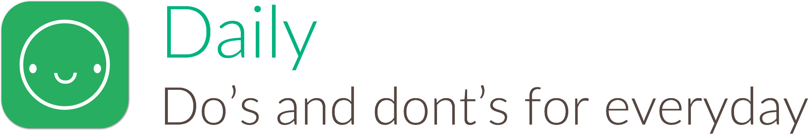

#

Daily is a free app that manages your most important habits. Everyday, make sure you consistently do things that matter to you, and don't do the things that don't.

[Get Daily on the App Store](https://itunes.apple.com/us/app/daily-keep-track-your-dos/id942352316) (and don't forget to smile more often).

Built while learning Swift – inspiration from [Jack Dorsey's YC Startup School talk](https://youtu.be/wEQawgkCMOU).

## License

Daily is released under the MIT license. See LICENSE for details.